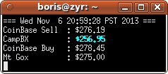

btc
====

About
---
Gets BTC:USD prices from Coinbase, CampBX, and Coinsetter. You can also buy bitcoins via Coinbase if an API key is provided.

Install
---
Run `setup.py` to initialize a configuration file and input your Coinbase API key.

Showing current rates
---
Run `btc` by itself to show current rates from Coinbase, CampBX, and Coinsetter. The CampBX price is bolded and in blue on \*NIX systems.

All rates (in non-realtime mode) are retrieved asynchronously to speed up the program. However, I haven't added locks yet to deal with printing to stdout at the same time so the formatting may occasionally be a little bit messed up. Use `btc --no-async` to run it slowly with all formatting intact.

Or use `btc --realtime <number of seconds>` to update the ticker continuously. If the number of seconds is left out, the default is every 300 seconds (5 minutes).

Buying Bitcoins via Coinbase
---
Run `btc --buy <number of bitcoins>` to buy bitcoins via Coinbase. The default number of bitcoins to buy is one. It will tell you the latest price on Coinbase, give you your total, and prompt for confirmation. The response with the order confirmation is output to the terminal in JSON (save this output just in case). Many times it will fail though due to an internal Coinbase limit.

Use `btc --buy <number of bitcoins> --dry-run` to simulate buying coins and show you the HTTP request that will be sent without actually sending it.

Possible future features
---
* [DONE] Making a realtime ticker of prices that will update itself periodically on the command line
* Implementing more of the Coinbase API

Help Info
---
	usage: btc.py [-h] [--buy [BUY]] [--dry-run] [--verbose] [--no-async]
				  [--realtime [REALTIME]]

	Buy BTC or Show BTC:USD rates

	optional arguments:
	  -h, --help            show this help message and exit
	  --buy [BUY]           Buy BTC
	  --dry-run             Simulate buying BTC but do not actually buy anything
	  --verbose
	  --no-async            Get prices one by one (slower but formatting is
							correct)
	  --realtime [REALTIME]
							Show realtime ticker refreshing every REALTIME seconds
							(Only on UNIX)

Other
---
This program uses Python 3

License
---
GPL Version 3
